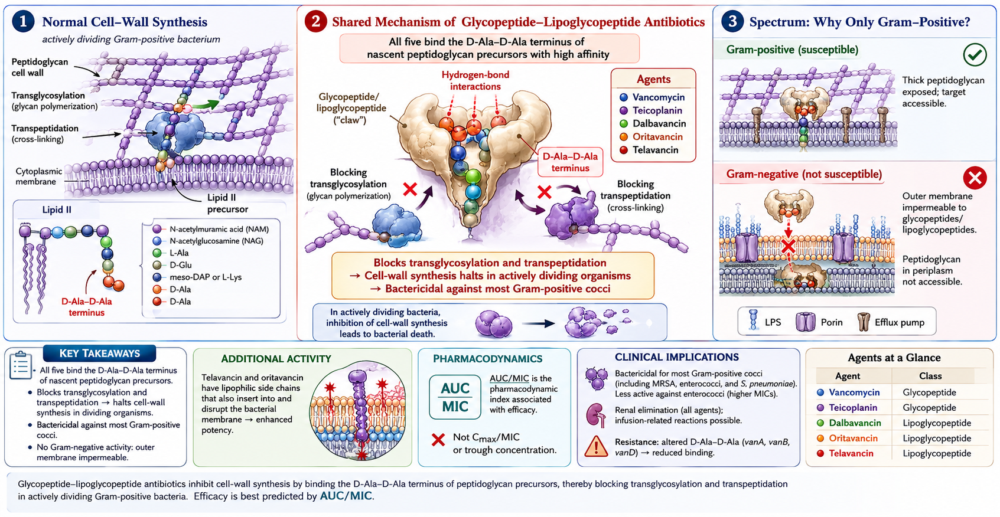
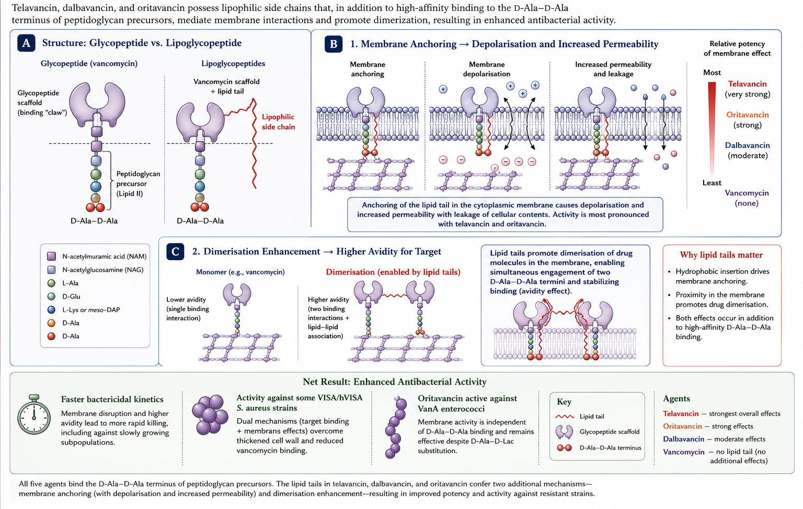
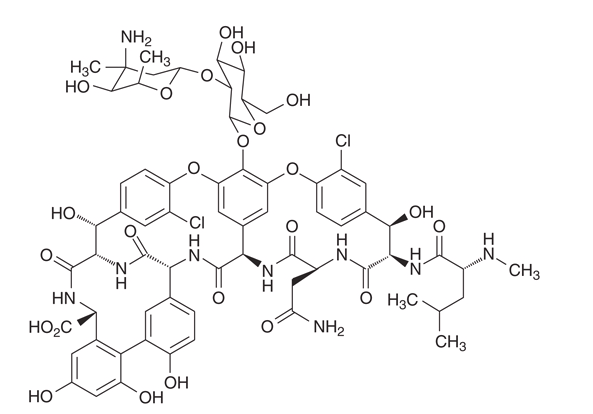
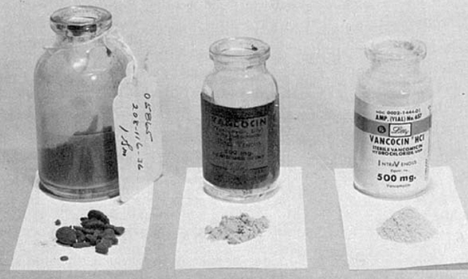
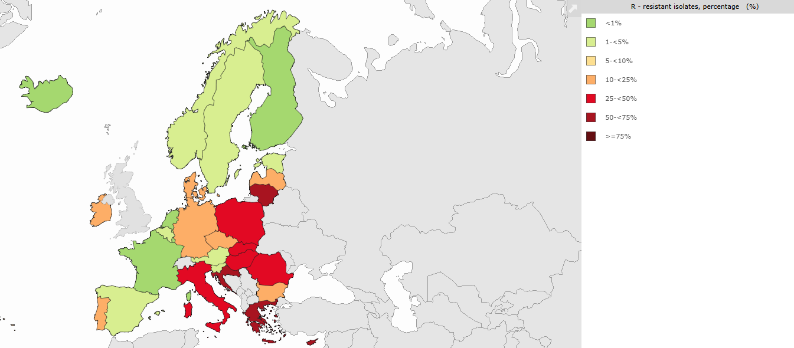
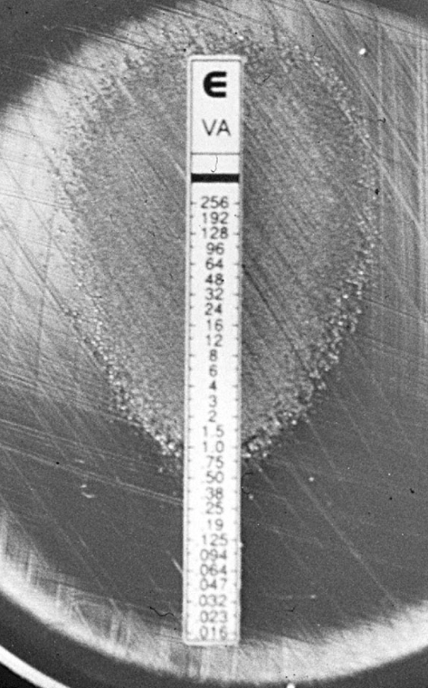
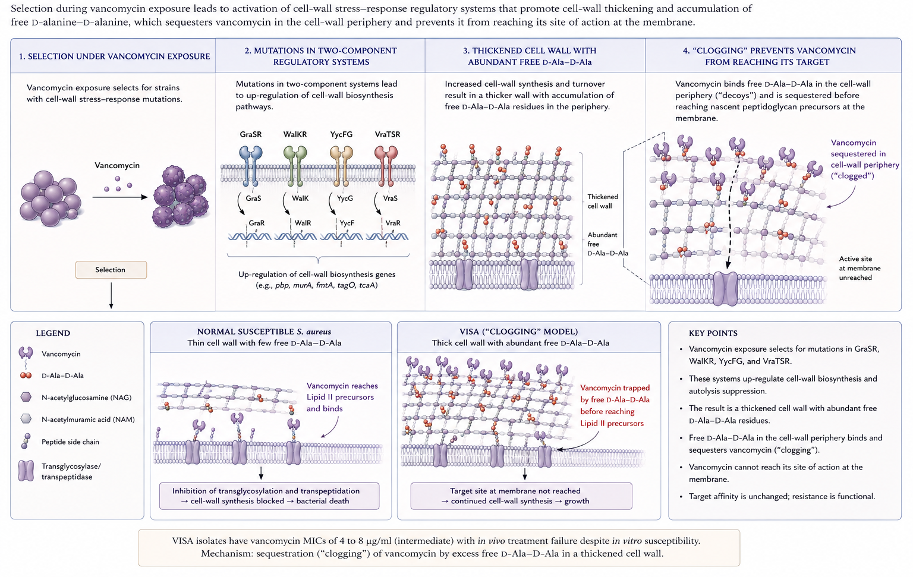
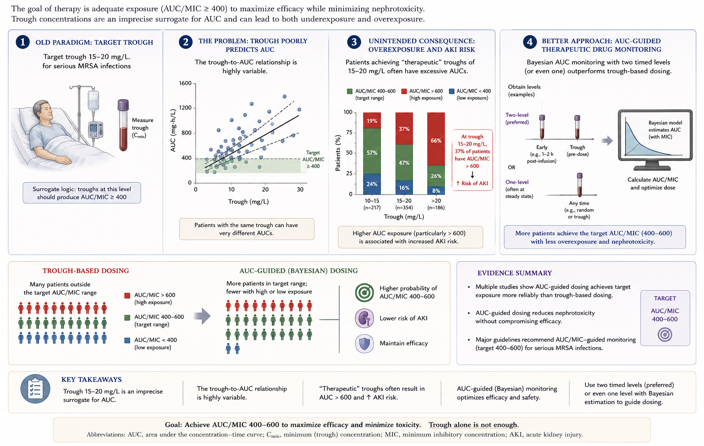
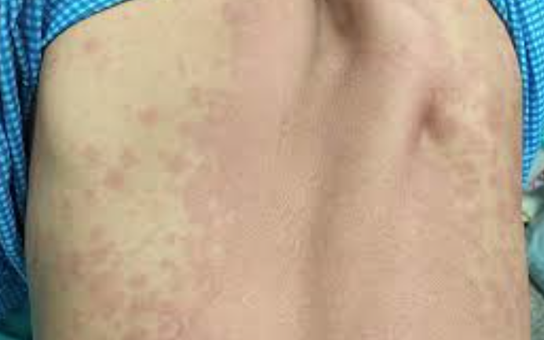
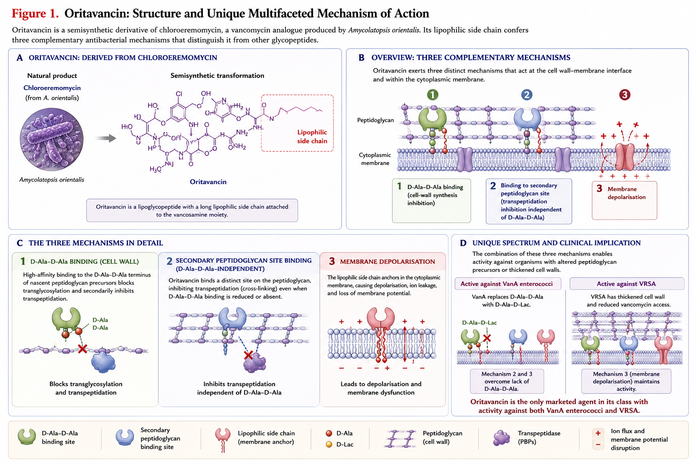

## Glycopeptide and Lipopeptide Antibiotics {background-video="glycopeptides-images/staphy.mp4" background-video-loop="true" background-video-muted="true" background-opacity="0.35" background-color="#b20e10"}

 

 

   

**Russell E. Lewis, Pharm.D., FCCP**   Associate Professor of Infectious Diseases  

{fig-align="center" width="350"}

   russelledward.lewis\@unipd.it   Slides and course materials: [www.idpadovaid.com](https://idpadova.com/)

## Learning objectives

 

By the end of this lecture, you should be able to:

- Compare the mechanisms of action of the five glycopeptide / lipoglycopeptide agents and explain how structural differences translate into different spectra
- Recognise the molecular basis of VRE, hVISA, VISA, and VRSA and the clinical implications of each
- Apply AUC-guided vancomycin dosing principles and identify candidates for alternative agents
- Choose appropriately between vancomycin, teicoplanin, and the lipoglycopeptides for specific clinical scenarios
- Anticipate and manage the toxicities and assay-interference of telavancin, dalbavancin, and oritavancin

# Class overview {background-color="#b20e10"}

## Five agents, one core mechanism

 

|   | Vancomycin | Teicoplanin | Telavancin | Dalbavancin | Oritavancin |
|------------|------------|------------|------------|------------|------------|
| **Class** | Glycopeptide | Glycopeptide | Lipoglycopeptide | Lipoglycopeptide | Lipoglycopeptide |
| **Year approved** | 1958 | 1988 (EU) | 2009 | 2014 | 2014 |
| **Half-life** | 6–12 h | 70–100 h | \~8 h | \~346 h | \~245 h |
| **US availability** | Yes | No | Yes | Yes | Yes |

::: aside
Teicoplanin has been in clinical use in Europe since the late 1980s but never received FDA approval, which is an interesting regulatory and commercial history rather than a scientific one. The half-life differences between vancomycin and the lipoglycopeptides drive most of the practical differences in how we use them.
:::

## Mechanism of action

{fig-align="center" width="1000"}

 

::: aside
Glycopeptides are bactericidal but slowly so compared to beta-lactams. The AUC/MIC index reflects this — duration of exposure matters more than peak. The lipoglycopeptides modify this with concentration-dependent activity from their membrane component, which is why they tolerate single-dose regimens [@Reynolds1989].
:::

## How glycopeptides bind D-Ala-D-Ala

 

- Five **hydrogen bonds** between the glycopeptide peptide backbone and the terminal D-Ala-D-Ala carbonyl/amino groups
- Binding affinity: K~D~ ≈ 10⁻⁶ M for vancomycin
- This molecular "lid" sterically blocks transglycosylase and transpeptidase access
- **Substitution to D-Ala-D-lactate** (VanA, VanB, VanD, VanM) removes one critical H-bond → affinity ↓ \~1000×
- **Substitution to D-Ala-D-serine** (VanC, VanE, VanG) reduces affinity \~7×

::: aside
The 1000-fold affinity loss from a single hydrogen bond substitution is one of the most elegant molecular explanations in microbiology. Understanding this helps with the rest: why VanB enterococci are still teicoplanin-susceptible (no induction), why oritavancin's secondary binding site rescues activity against VanA, and why telavancin's membrane mechanism partially compensates for VISA cell-wall thickening [@Walsh1993; @Williams1999].
:::

## Why lipoglycopeptides act differently

{fig-align="center" width="800"}

::: aside
The "dual mechanism" of telavancin and the "triple mechanism" of oritavancin are often presented in marketing materials. The clinically relevant consequences are: (1) preserved or enhanced activity against organisms with reduced vancomycin susceptibility, (2) faster kill in vitro and in vivo, and (3) for oritavancin specifically, retained activity against VanA enterococci because of the secondary peptidoglycan binding site[@Higgins2005; @Lunde2009].
:::

# Vancomycin {background-color="#b20e10"}

## Vancomycin structure

 

- Tricyclic glycopeptide, MW \~1,449 Da
- Heptapeptide backbone + two attached sugars (vancosamine, glucose)
- Peptide backbone binds D-Ala-D-Ala via **five hydrogen bonds**
- High-affinity binding defines class activity but limits target flexibility

{fig-align="center" width="350"}

::: notes
A structural figure would be ideal here — many open-access sources have vancomycin chemical structures. Wikimedia Commons has a CC-licensed structure. The point I want students to take away is that the high-affinity binding is both vancomycin's strength (potent activity) and weakness (one mutation in the target wipes out activity).
:::

## A potted history

 

- Isolated 1953 from *Amycolatopsis orientalis* in Borneo soil
- FDA approval 1958 for penicillin-resistant *S. aureus*
- Early lots: **"Mississippi mud"** — impurities caused ototoxicity and nephrotoxicity
- Use dropped after methicillin (1960) and the new β-lactams arrived
- Re-emergence in the 1980s with rising MRSA prevalence → use went from \~2 tonnes/yr (1984) to \>11 tonnes/yr (1996) in the US alone

{fig-align="center" width="350"}

::: aside
The "Mississippi mud" history is more than a curiosity — early purity problems anchored vancomycin's reputation for toxicity, which we now know was partly driven by contaminants rather than the molecule itself. Modern preparations have a much better safety profile, which matters when reading older comparative literature [@Kirst1998].
:::

## Vancomycin spectrum

 

**Active against** (gram-positives, dividing):

- *Staphylococcus aureus* — MSSA, MRSA, hVISA (partially), VISA (reduced)
- Coagulase-negative staphylococci
- Streptococci (groups A–G, *S. pneumoniae*, viridans)
- Enterococci (susceptible strains; VRE = resistant)
- *Listeria monocytogenes*, *Corynebacterium jeikeium*
- *Clostridioides difficile*, *Cutibacterium acnes*

**Not active**: gram-negatives, mycobacteria, fungi

::: notes
Remember that vancomycin is bacteriostatic against enterococci, not bactericidal. This matters for endocarditis where combination therapy with an aminoglycoside or beta-lactam is needed. Also: VRE incidence varies enormously by region — much higher in the US and parts of Europe than in Northern Europe or Australia.
:::

## Vancomycin tissue penetration

 

| Tissue | Penetration | Notes |
|------------------------|------------------------|------------------------|
| Lung epithelial lining fluid | \~20% serum | Lower than linezolid (\~415%) |
| Bone | \~10–30% | Variable; consider higher doses |
| CSF (inflamed meninges) | 7–21% | Inadequate without inflammation |
| Vitreous humour | \<5% | Need intravitreal for endophthalmitis |
| Synovial fluid | \~70% | Adequate for septic arthritis |
| Skin / soft tissue | \~30–40% | Adequate for typical ABSSSI MICs |

   

→ Limitations underlie use of **adjunctive** intraventricular, intraperitoneal, intravitreal routes.

::: aside
The bone and CSF penetration limitations explain why we often need high-dose vancomycin for osteomyelitis or meningitis, and why intraventricular vancomycin is needed for shunt infections despite adequate IV dosing. Lung ELF penetration is the often-cited disadvantage vs linezolid for MRSA pneumonia [@Boselli2005].
:::

# Vancomycin resistance — VRE {background-color="#b20e10"}

## VRE epidemiology

 

- Globally widespread, predominantly **VanA** and **VanB** phenotypes in *Enterococcus faecium*
- **NHSN data (US, 2011–2014)**: VRE accounted for 28% of HAI enterococcal isolates
- **EARS-Net 2019 (EU)**: enormous regional variation — \<1% (Nordic) to \>50% (some Eastern European countries) for *E. faecium*
- Latin America VENOUS-I cohort: dominant clones differ from US/EU

::: aside
[@Weiner2016; @ECDC2020; @Contreras2021]
:::

::: notes
Russ — for the Italian audience, EARS-Net data show Italy at the higher end of European VRE prevalence, around 20-30% for E. faecium bacteraemia. This is relevant for empirical decisions in nosocomial endocarditis and CLABSI.
:::

## EARS-Net data   Vancomycin-resistant Enterococci in Europe

 

{fig-align="center"}

## VRE mechanisms — the *van* gene clusters

 

| Operon | Resistance level | Vancomycin | Teicoplanin | Substrate |
|----|----|----|----|----|
| **VanA** | High | R | R | D-Ala-D-lactate |
| **VanB** | Variable | R | **S** | D-Ala-D-lactate |
| **VanC** (intrinsic) | Low | R | S | D-Ala-D-serine |
| **VanD, VanM** | High | R | R | D-Ala-D-lactate |
| **VanE, VanG, VanL, VanN** | Low | R | S | D-Ala-D-serine |

   

The key trick: **substitution of D-Ala-D-Ala with D-Ala-D-lactate or D-Ala-D-serine** at the peptidoglycan terminus reduces vancomycin affinity by \~1000-fold (lactate) or \~7-fold (serine).

::: aside
[@Ahmed2018; @Guffey2021]
:::

::: aside
VanB is the one to remember clinically: vancomycin-resistant but teicoplanin-susceptible because vanRSB doesn't induce expression in response to teicoplanin. So in regions with predominantly VanB phenotype, teicoplanin can still be useful for enterococcal infections. VanA induces with either drug. The lactate substitution removes one of five hydrogen bonds that anchor vancomycin to D-Ala-D-Ala — and that single missing bond reduces binding affinity by three orders of magnitude.
:::

## VDE — vancomycin-dependent enterococci

 

::::: columns
::: {.column width="50%"}
{fig-align="center" width="250"}
:::

::: {.column width="50%"}
- Rare but described: enterococci that **require vancomycin to grow**
- Mechanism: loss of endogenous D-Ala-D-Ala ligase; rely entirely on vancomycin-induced D-Ala-D-Lac ligase
- Practical impact: undetectable on routine media without vancomycin
- Can revert to vancomycin-independent
:::
:::::

::: aside
Mostly a microbiology curiosity but worth knowing — VDE strains can be missed on standard cultures and may be flagged by alert lab staff who notice growth only on vancomycin-containing media.
:::

# Vancomycin resistance — staphylococci {background-color="#b20e10"}

## hVISA, VISA, VRSA — the definitions

 

| Strain | MIC | Mechanism | Frequency |
|------------------|------------------|------------------|------------------|
| **Susceptible** | ≤2 μg/mL | Wild type | Majority of *S. aureus* |
| **hVISA** | ≤2 (population); 4–8 (subpopulation) | Cell wall thickening; TCS mutations (GraSR, WalKR, VraTSR) | \~6% global pooled prevalence |
| **VISA** | 4–8 μg/mL | Same as hVISA, more pronounced | \<0.5% globally |
| **VRSA** | ≥16 μg/mL | Acquired *vanA* operon from VRE | \~16 confirmed cases in US through 2023 |

::: aside
[@Shariati2020; @Howden2011; @CDC2023]
:::

::: notes
The pooled global hVISA prevalence of \~6% is a reasonable working number, though there's enormous heterogeneity by region and detection method. Detection is hard — standard CLSI broth microdilution misses hVISA. Population analysis profiling (PAP-AUC) is the gold standard but isn't routine. The clinical labs that do test typically use macro Etest, which has imperfect sensitivity and specificity. Worth knowing if your lab does or does not screen.
:::

## VISA mechanism — the "clogging" model

{fig-align="center" width="800"}

::: aside
Conceptually elegant — the bug doesn't change its target, it builds extra target to soak up the drug. Same therapeutic implication: more vancomycin is unlikely to overcome it, so switch agents. Linezolid, daptomycin (with caveats for cross-resistance), ceftaroline, or one of the lipoglycopeptides are alternatives [@Hiramatsu2001; @Howden2010].
:::

## VRSA — the rare event

 

- Acquisition of the **enterococcal *vanA* operon** by MRSA, usually in patients with concomitant VRE infection
- Conjugative transfer in vivo demonstrated experimentally and in clinical isolates
- First US case 2002; total **\~16 confirmed US cases** as of 2023
- Most isolates: high-level resistance (MIC ≥32 μg/mL) but **susceptible to linezolid, daptomycin, ceftaroline, oritavancin**

::: aside
VRSA is rare enough that you may never see a case, but you should recognise the risk factor — chronic wounds with concomitant MRSA and VRE colonisation in patients on prolonged vancomycin. The clinical implication is straightforward: treatment options exist but require active resistance testing [@CDC2023; @Sievert2008].
:::

## MIC "creep" and clinical failure

 

- Multiple cohorts: MRSA bacteraemia with vancomycin MIC at the **upper end of susceptibility (1.5–2 μg/mL by Etest)** linked to higher failure, persistence, and mortality
- Cochrane meta-analysis confirmed association but emphasised heterogeneity of testing methods
- **IDSA 2011 MRSA guidelines**: consider alternative agent if persistent bacteraemia despite adequate exposure OR MIC \>2 μg/mL

::: aside
[@Sakoulas2004; @VanHal2012; @Liu2011]
:::

::: notes
The "MIC creep" literature is contested — some surveillance data show no systematic upward shift in vancomycin MICs over time. What's not contested is that within the susceptible range, higher MICs are associated with worse outcomes. The interpretation that's most defensible: at MIC 2, vancomycin is on the edge of doing what we need, particularly for high-inoculum infections like endocarditis or deep bone. Switch to daptomycin or another agent if the patient isn't responding.
:::

# Vancomycin PK/PD {background-color="#b20e10"}

## Pharmacodynamic target: AUC/MIC ≥ 400

 

- *In vivo* and clinical data: **AUC₂₄ / MIC ≥ 400** correlates with clinical response and microbiologic eradication in MRSA
- AUC \> 600 mg·h/L correlates with **nephrotoxicity**
- Therapeutic window for serious MRSA infections: **AUC 400–600**

::: aside
The AUC/MIC target of 400 is derived from a relatively small clinical cohort by Moise-Broder in 2004 — well-cited but with limitations. The upper bound of 600 is even less settled and comes mostly from retrospective AKI signals. The 400-600 window is a reasonable working range but we shouldn't over-interpret the precision [@MoiseBroder2004b; @Lodise2020] .
:::

## Why trough monitoring isn't enough

{fig-align="center" width="800"}

 

::: aside
Bayesian software like InsightRx, DoseMe, or PrecisePK is increasingly available; the alternative is two-level first-order equations. The evidence base for AUC monitoring is still mostly retrospective — large prospective trials are ongoing — but the pharmacokinetic logic is sound [@Lodise2020; @Rybak2020].
:::

## 2020 ASHP/IDSA/PIDS/SIDP guidelines — key points

 

- For serious MRSA infections (bacteraemia, endocarditis, pneumonia, meningitis, osteomyelitis):
  - **AUC₂₄ target 400–600** (assuming MIC ≤1 mg/L by BMD)
  - **Bayesian-derived AUC** preferred; first-order equations from two timed concentrations acceptable
  - **Loading dose 25–30 mg/kg** (actual body weight) for severely ill patients
- For non-serious infections: trough-based monitoring may still be acceptable

::: aside
[@Rybak2020]
:::

::: notes
The 2020 revision was a major shift. Implementation has been uneven — surveys suggest that maybe a third to a half of US hospitals have moved to AUC-based dosing as of 2024. Italian uptake is slower but the major academic centres are moving in that direction.
:::

## Vancomycin in special populations

 

- **Neonates / VLBW infants**: weight- and PMA-based dosing; AUC monitoring increasingly available; hearing screening recommended after prolonged courses
- **Children**: AUC₂₄ target 400–600 for serious MRSA; Bayesian tools especially useful given inter-patient variability
- **Pregnancy**: category B/C; minimal transplacental passage in ex vivo models; therapeutic fetal concentrations reached in overt amnionitis; no demonstrated teratogenicity in second/third trimester
- **Obesity**: dose by **actual body weight**, but cap loading at 3 g; obese patients often achieve higher AUC than non-obese at same mg/kg
- **Elderly**: heightened nephrotoxicity risk; use lower trough/AUC targets where clinically acceptable

::: aside
[@Rybak2020]
:::

::: notes
The obesity dosing question comes up a lot. The current consensus is to dose by actual body weight with a cap, then monitor and adjust based on AUC. Older guidelines used adjusted body weight but that under-dosed many patients. Pregnancy data are reassuring for second/third trimester use but data on first-trimester exposure are sparse.
:::

## Vancomycin dosing summary

 

| Population | Recommended dose | Comment |
|------------------------|------------------------|------------------------|
| Adult, normal renal function | 15–20 mg/kg q8–12 h | Use actual body weight |
| Severe sepsis / endocarditis / meningitis | Loading 25–30 mg/kg → 15–20 mg/kg q8–12 h | Loading ≤500 mg/h |
| Continuous infusion | 30–40 mg/kg/day after 15 mg/kg loading | Lower AKI; equivalent efficacy |
| HD (after session) | Load 25 mg/kg → 7.5–10 mg/kg (low-perm) or 10–15 mg/kg (high-perm) | Adjust to predialysis level 15–20 mg/L |
| CRRT (CVVH/CVVHD) | Load 20 mg/kg → 500 mg q8h | Increase for effluent \>35 mL/kg/h |
| Children | Weight-based; AUC-targeted | Bayesian tools especially useful |

::: aside
[@Rybak2020]
:::

::: notes
Continuous infusion deserves a mention — meta-analyses consistently show less nephrotoxicity with continuous infusion vs intermittent, with no efficacy penalty. Practical considerations (line dedication, drug-incompatibility) keep it less common than it should be in many ICUs.
:::

## Local administration

 

- **Intraperitoneal (CAPD peritonitis)**: 15–30 mg/kg in long dwell (≥6 h) every 5–7 days
- **Intraventricular (ventriculitis, shunt infection)**: 5 mg (slit ventricles), 10 mg (normal), 15–20 mg (enlarged); reduce 60% in infants
- **Intraocular (endophthalmitis)**: 1 mg intravitreal
- **Oral** (*C. difficile*): 125 mg q6h × 10 days (fulminant: 500 mg q6h + IV metronidazole)

::: aside
[@Li2016]
:::

::: notes
Intraventricular vancomycin is something every ID consultant should be comfortable advising on. Doses are tiny relative to systemic. Watch for the rare reports of hemorrhagic occlusive retinal vasculitis with intracameral vancomycin prophylaxis after cataract surgery — there's been a push to abandon that practice for that reason.
:::

# Vancomycin adverse effects {background-color="#b20e10"}

## Vancomycin infusion (red-man) syndrome

   

::::: columns
::: {.column width="50%"}
{fig-align="center"}
:::

::: {.column width="50%"}
- Rapid erythematous flushing of head, face, neck, upper trunk during infusion
- Often with pruritus, occasionally hypotension/angioedema
- **Mechanism: direct mast cell histamine release** — not IgE-mediated
- Incidence 3.4–14% (higher in children, 14%)
- Risk factors: faster infusion rate, higher concentration, concurrent opioids/anaesthetics
- Management: stop infusion, antihistamine, restart at half rate (\<10 mg/min)
:::
:::::

::: aside
Common exam question and common clinical scenario. Thisis not an allergy, it's a pseudoallergic reaction. Patients can usually continue vancomycin with slower infusion and antihistamine premedication. True IgE-mediated anaphylaxis to vancomycin is exceedingly rare [@ramakumar2021].
:::

## Nephrotoxicity

 

**Risk factors** (additive):

- AUC \> 650 mg·h/L (≈ trough ≥ 15 mg/L)
- Concomitant nephrotoxins, possibly **piperacillin-tazobactam**
- Duration \>14 days
- Pre-existing renal disease, advanced age, obesity, sepsis, hypovolaemia

**Mechanisms**: oxidative tubular injury, immune-mediated interstitial nephritis, intratubular cast obstruction

::: aside
The vancomycin + piperacillin-tazobactam AKI signal is one of the more discussed associations of the past decade. The risk is amplified when these two drugs are combined relative to either alone or vancomycin combined with cefepime or a carbapenem. Mechanism is still debated — some argue it's a tubular casting artefact rather than true injury, but functional creatinine rises do happen. Where feasible, consider alternatives or limit duration [@Hidayat2006; @Lodise2020].
:::

## Other adverse effects

 

- **Ototoxicity**: rare with modern preparations; cumulative dose- and duration-related; very-low-birthweight infants at higher risk
- **Neutropenia**: 1–2% short courses, 12–13% with prolonged therapy
- **Thrombocytopenia**: rare; can be immune-mediated
- **Rash / drug fever**: 3% / 2%; DRESS and SJS/TEN rare but reported
- **Linear IgA bullous dermatosis**: classic vancomycin association
- **C. difficile colitis** from IV vancomycin (paradoxically reported)

::: aside
[@Marissen2020]
:::

::: aside
Linear IgA bullous dermatosis is the boards-favourite vancomycin association — sub-epidermal vesicles with characteristic IgA deposition on direct immunofluorescence. Resolves on drug withdrawal. Worth recognising clinically.
:::

## Preventing vancomycin AKI

 

- **AUC-guided dosing** with target 400–600 mg·h/L
- Avoid concomitant nephrotoxins (consider avoiding **piperacillin-tazobactam** — use cefepime or carbapenem if combination needed)
- Maintain euvolaemia; correct hypovolaemia before high-dose courses
- Reassess need for vancomycin daily; **de-escalate** if MRSA ruled out
- Consider continuous infusion in critically ill patients
- For high-risk patients, consider alternative agent (daptomycin, linezolid, ceftaroline) if MRSA confirmed

::: aside
[@Rybak2020; @Luther2018]
:::

::: aside
This is bedside-practical. The single most impactful change in your unit is probably switching empirical regimens from vanc+pip-tazo to vanc+cefepime or vanc+carbapenem (or moving away from empirical vancomycin entirely when there's no compelling MRSA reason). De-escalation is undervalued — many patients stay on vancomycin for days past the point where it's needed.
:::

# Vancomycin clinical uses {background-color="#b20e10"}

## MRSA bacteraemia and endocarditis

 

- Vancomycin remains first-line when daptomycin not appropriate
- AUC-guided dosing; loading dose for severe disease
- Consider **alternative agent** if:
  - Persistent bacteraemia ≥ 7 days despite adequate exposure
  - MIC \> 2 μg/mL
  - Endovascular source not controlled
- Alternatives: daptomycin (high dose ≥8 mg/kg), ceftaroline, daptomycin + ceftaroline, dalbavancin (off-label)

::: aside
[@Liu2011; @Kalil2016]
:::

::: notes
The IDSA 2025 updated bacteraemia guidance is even more permissive of alternatives — daptomycin first-line for many is increasingly common practice. Daptomycin + ceftaroline combination is increasingly used for persistent bacteraemia despite limited RCT evidence, based on synergy data and observational cohorts.
:::

## MRSA pneumonia

 

- Vancomycin and **linezolid** both recommended first-line in IDSA/ATS HAP/VAP guidelines
- Linezolid: higher epithelial lining fluid concentration; reduced renal toxicity
- Most randomised trials: clinical equivalence
- For necrotising pneumonia or PVL-positive strains, linezolid often preferred (toxin suppression)

::: aside
[@Kalil2016]
:::

::: aside
Necrotising MRSA pneumonia is the scenario where the toxin-suppression argument for linezolid (or clindamycin combination) becomes important. The evidence is mostly observational but the mechanism is biologically plausible — protein-synthesis inhibitors reduce expression of PVL and other exotoxins.
:::

## Persistent MRSA bacteraemia — alternatives

 

- **Daptomycin** ≥ 8 mg/kg (high-dose to reduce resistance emergence)
- **Daptomycin + ceftaroline** combination — synergy in vitro; observational survival benefit in persistent bacteraemia
- **Daptomycin + β-lactam (oxacillin, nafcillin, anti-staphylococcal penicillin)** — "seesaw effect"
- **Ceftaroline monotherapy** — option for daptomycin-non-susceptible
- **Linezolid** — "bacteriostatic," generally not first choice for bacteraemia but role in refractory cases
- **Investigational**: oritavancin or dalbavancin for off-label bacteraemia / endocarditis continuation

::: aside
The dapto + ceftaroline combination has become standard rescue therapy in many academic centres for persistent MRSA bacteraemia, based on the 2019 Geriak RCT (small but suggestive of survival benefit). The seesaw effect — daptomycin susceptibility *improves* with concomitant β-lactam exposure — is the molecular rationale. For most patients, switching from vancomycin to high-dose daptomycin alone is the simpler first move [@Geriak2019].
:::

## VRE bacteraemia — treatment choices

 

| Agent | Pros | Cons |
|------------------------|------------------------|------------------------|
| **Linezolid** 600 mg q12h | Oral option; effective; widely available | Bone marrow suppression with prolonged use; serotonin syndrome with SSRIs |
| **Daptomycin** ≥10 mg/kg | Bactericidal; once-daily | High doses needed; resistance emergence reported |
| **Tigecycline** | Activity vs VRE | Low serum levels; FDA mortality signal |
| **Oritavancin** | Single-dose; active vs VanA | Off-label; aPTT interference; cost |
| **Quinupristin-dalfopristin** | Active vs *E. faecium* (not *faecalis*) | IV only; arthralgia/myalgia; venous irritation |

::: aside
[@Munita2015; @Contreras2021]
:::

::: notes
For VRE bacteraemia, daptomycin high-dose and linezolid are both reasonable first-line choices in 2025. The high-dose daptomycin trend (10-12 mg/kg) reflects concerns about emergence of resistance at lower doses. Oritavancin is increasingly used off-label for VRE — particularly attractive because the long half-life means a single dose can cover much of the typical 14-day course.
:::

## Bacterial meningitis

 

- Empirical: vancomycin + 3rd-generation cephalosporin (cefotaxime or ceftriaxone) in adults
- Rationale: penicillin-resistant *S. pneumoniae* coverage
- Add ampicillin for *Listeria* if age \>50 or immunocompromised
- Add dexamethasone for suspected pneumococcal meningitis

::: notes
Standard empirical regimen most ID consultants give in their sleep — but worth reinforcing for the postgrad audience that vancomycin's CSF penetration is modest, and that this is one indication where the AUC/MIC = 400 target may not be achievable even with high doses. For documented penicillin-resistant pneumococcal meningitis, intraventricular vancomycin is sometimes added for severe cases.
:::

## *C. difficile* infection

 

- **Oral vancomycin 125 mg q6h × 10 days**
  - first-line for non-fulminant initial episode (IDSA/SHEA 2021)
- **Fidaxomicin** preferred when available (lower recurrence)
- Recurrent CDI: tapering/pulsed oral vancomycin OR fidaxomicin OR bezlotoxumab adjunct
- Fulminant disease: vancomycin 500 mg q6h PO + metronidazole 500 mg IV q8h ± rectal vancomycin

::: aside
[@Johnson2021]
:::

::: notes
Oral vancomycin is not absorbed systemically — fecal concentrations are 1000+ μg/g — so therapeutic drug monitoring isn't relevant. Watch for the very rare scenario of detectable serum levels in patients with severe colonic inflammation and renal failure receiving high-dose oral.
:::

# Teicoplanin {background-color="#b20e10"}

## Teicoplanin — distinguishing features

 

- Glycopeptide complex from *Actinoplanes teichomyceticus*
- **Lipophilic side chain** → high protein binding (\~90–95%), long half-life
- Spectrum largely overlaps vancomycin
- Higher MIC in some staphylococcal species (notably *S. haemolyticus*)
- **VanA**: resistant; **VanB**: susceptible (no induction)
- **Not available in the United States**

::: aside
The half-life advantage and possibly lower nephrotoxicity make teicoplanin attractive where it's available. The US not having it is mostly a regulatory and commercial story — Marion-Merrell Dow filed but withdrew in the 1990s, and no one has refiled.
:::

## Teicoplanin TDM — the critical detail

 

| Indication | Target trough (mg/L) | Loading regimen |
|------------------------|------------------------|------------------------|
| Uncomplicated MRSA / soft tissue | 15–30 | 10 mg/kg q12h × 5 doses OR 12 mg/kg q12h × 3 doses |
| Complicated / serious MRSA (endocarditis, bone) | 20–40 | 12 mg/kg q12h × 5 doses |
| Non-MRSA, less serious | — | 6 mg/kg q12h × 3 doses |

 

**Maintenance**: 6 mg/kg/day after loading. **Always load** — half-life is too long to wait for steady state.

::: aside
:::

::: aside
Failing to load is the most common reason for treatment failure. Trough \<20 mg/L on day 4 is associated with worse outcomes in *S. aureus* infection. The loading regimen scales with infection severity. Many older European practice patterns under-dose teicoplanin because they predate the modern target-trough literature [@Pea2003].
:::

## Teicoplanin — practical pearls

 

- Trough monitoring on day 4 (steady state after loading)
- Can be given **IM bolus** when IV access difficult
- Can give entire daily dose as **slow bolus IV** (no 60-minute infusion needed)
- Reduced **red-neck syndrome** vs vancomycin
- For VanB enterococcal endocarditis, teicoplanin remains a legitimate option
- Continued therapy at home (OPAT): once-daily dosing supports this

::: aside
The IM administration option is a small but real practical advantage — useful in patients with difficult IV access where lipoglycopeptides aren't appropriate. The once-daily home OPAT use case is common in European practice but underused even where teicoplanin is available.
:::

## Teicoplanin clinical use cases

 

**Where teicoplanin shines**:

- Outpatient continuation therapy (once-daily dosing, IM or IV bolus possible)
- Patients intolerant of vancomycin (red-neck, less nephrotoxicity)
- VanB enterococcal infection
- Settings where AUC monitoring not feasible (trough-based TDM is simpler)

**Caveats**:

- Inferior to vancomycin in early endocarditis trials at low doses
- With aggressive loading and target-trough maintenance, modern outcomes comparable

::: aside
:::

::: aside
The 2009 Svetitsky meta-analysis is the standard reference on nephrotoxicity comparison — about a 40% lower relative risk of nephrotoxicity with teicoplanin vs vancomycin. Efficacy comparable when adequately loaded and dosed [@Svetitsky2009].
:::

# Lipoglycopeptides  — the three newcomers {background-color="#b20e10"}

## Three drugs, three personalities

 

|   | Telavancin | Dalbavancin | Oritavancin |
|------------------|------------------|------------------|------------------|
| **Parent compound** | Vancomycin | A40926 (teicoplanin-like) | Chloroeremomycin (vancomycin analog) |
| **t½** | \~8 h | \~346 h (\~14 d) | \~245 h (\~10 d) |
| **Dosing** | 10 mg/kg q24h | 1000 mg + 500 mg/wk OR 1500 mg × 1 | 1200 mg × 1 |
| **Renal adj.** | Yes | No | No |
| **Key activity gap** | None vs VRSA | None vs VRSA | **Active vs VRSA, VanA** |
| **Indications** | ABSSSI, HAP/VAP | ABSSSI | ABSSSI |
| **Coag assay issue** | PT/aPTT/INR | None | aPTT × 5 days |

::: aside
This single comparison table captures most of what's clinically distinguishing about the three. The half-life differences and the coag-assay issues are what most affect practical decision-making [@Vibativ2009; @Durata2017; @Orbactiv2018].
:::

# Telavancin {background-color="#b20e10"}

## Telavancin mechanism and spectrum

 

- Vancomycin parent + decylaminoethyl tail (membrane-anchor) + phosphonomethylaminomethyl group
- **Dual mechanism**: D-Ala-D-Ala binding + membrane depolarisation
- 4–8× lower MICs than vancomycin against susceptible *S. aureus*
- **Activity preserved** against most VISA, hVISA
- **Inactive** against VRSA, VanA enterococci

::: notes
The dual mechanism is the marketing pitch. Clinically, the lower MIC and faster bactericidal kinetics matter most for high-inoculum infections like endocarditis (where telavancin was never developed as a primary indication, oddly) [@Higgins2005].
:::

## Telavancin — the boxed warnings

 

::: callout-warning
- **Nephrotoxicity** — higher than vancomycin, particularly in patients with baseline CrCl \<50 mL/min
- **Fetal harm** — animal teratogenicity; pregnancy test required before initiation in women of childbearing potential
- **QTc prolongation** — avoid in long-QT syndrome, uncompensated CHF, severe LVH, or concomitant QT-prolonging drugs
:::

Plus: **coagulation assay interference** — PT, aPTT, INR, ACT spuriously prolonged. Draw before next dose for accurate result.

::: notes
Three boxed warnings is a lot, and they have substantially limited uptake. Telavancin sits in a difficult niche — clinically useful in selected patients but with enough red flags that most clinicians reach for alternatives unless nothing else works. The renal signal in the ATTAIN trials, particularly the mortality difference in the subgroup with baseline CrCl \<50, was the most concerning finding [@Stryjewski2008; @Vibativ2009].
:::

## Telavancin clinical evidence

 

- **ABSSSI (ATLAS 1 and 2)**: non-inferior to vancomycin; cure 88.3% vs 87.1%, and 90.6% vs 86.4% in MRSA subgroup
- **HAP/VAP (ATTAIN 1 and 2)**: non-inferior to vancomycin overall; **higher mortality in the subgroup with CrCl \<50 mL/min**
- **Approved indications (US)**: cSSSI, HAP/VAP caused by *S. aureus* when alternatives are inappropriate

::: aside
The HAP/VAP indication came with the caveat — "when alternative treatments are not suitable" — because of the mortality signal in renal-impaired patients. This is a typical FDA pattern when efficacy is there but safety is wobbly [@Stryjewski2008; @Rubinstein2011].
:::

# Dalbavancin {background-color="#b20e10"}

## Dalbavancin — defining feature is half-life

 

- Parent: A40926 (teicoplanin-like glycopeptide), modified with lipophilic side chain
- **t½ \~346 hours (\~14 days)**; **\~33% of drug still in plasma at 14 days**
- Binds D-Ala-D-Ala with enhanced dimerisation
- Activity: MRSA, MSSA, CoNS, streptococci, vancomycin-susceptible enterococci
- Activity reduced against VISA; **inactive** against VRSA, VanA enterococci

::: aside
The half-life is the headline. Two-dose or single-dose treatment that delivers a full course on day 1 — the clinical operational implications are huge for outpatient management of skin infections [@Boucher2014].
:::

## Dalbavancin — clinical trial backbone

 

- **DISCOVER 1 and 2** (Boucher 2014): two-dose regimen (1000 mg + 500 mg/wk) non-inferior to vancomycin → linezolid for ABSSSI
- **DUR001-303** (Dunne 2016): single-dose 1500 mg non-inferior to two-dose regimen
- **Rappo 2018**: randomized comparator-controlled trial for adult osteomyelitis — high cure rates with two-dose dalbavancin
- **DOTS** (Turner 2025): RCT, dalbavancin (days 1 + 8) vs standard IV therapy for completion treatment in complicated *S. aureus* bacteraemia after blood-culture clearance — not superior but noninferior; comparable safety
- **Vertebral osteomyelitis** (open-label cohort): efficacious; growing real-world experience

::: aside
DISCOVER trials established ABSSSI indication. The single-dose 1500 mg regimen (Dunne 2016) is increasingly preferred for operational simplicity. Off-label use in osteomyelitis and infective endocarditis is growing fast — particularly in IV drug users and other populations where adherence to prolonged IV therapy is challenging [@Boucher2014; @Dunne2016; @Rappo2018; @Turner2025] .
:::

## DOTS — Pharmacokinetic data

 

**Population PK model** (n = 97, 640 samples): 3-compartment, zero-order input, first-order elimination

| Parameter      | Estimate  | 95% CI      | IIV (CV%) |
|----------------|-----------|-------------|-----------|
| CL             | 0.066 L/h | 0.062–0.069 | 22.6%     |
| V~1~ (central) | 5.67 L    | 5.37–5.99   | 19.7%     |

 

- **Protein binding \>99%** in 92.3% of paired samples — substantially higher than previously estimated (\~93%)
- Unbound concentrations linked to total via power function: C~U~(t) = A × C~T~(t)^K^

::: aside
Secondary PK analysis of the DOTS RCT. Unbound concentrations measured by ultracentrifugation with Tween-80 presaturated plasticware, avoiding radiolabeled equilibrium dialysis artifacts. Key methodological point: prior estimates of \~93% protein binding came from radiolabeled equilibrium dialysis, which cannot reliably quantify binding beyond the radiochemical purity of the labeled compound (typically 97–99%). The ultracentrifugation method used here avoids membrane binding artifacts and nonspecific adsorption, yielding the \>99% figure. This has important implications for PK/PD target interpretation. [@lodise2026].
:::

## DOTS PK — covariate effects on disposition

 

| Covariate            | Parameter affected | Exponent | 95% CI         |
|----------------------|--------------------|----------|----------------|
| Creatinine clearance | CL ↑               | 0.21     | 0.16–0.30      |
| Body weight          | V~1~ ↑             | 0.57     | 0.37–0.86      |
| Body weight          | V~2~ ↑             | 0.82     | 0.37–1.46      |
| Body weight          | V~3~ ↑             | 0.56     | 0.30–0.82      |
| Albumin              | V~2~ ↓             | −0.81    | −1.79 to −0.32 |
| Albumin              | f~u~ scaling ↓     | −0.78    | −0.98 to −0.54 |
| Age                  | V~3~ ↑             | 0.63     | 0.44–0.83      |

All covariates entered as power functions on the respective parameter.

::: aside
Albumin was the primary determinant of variability in fraction unbound — not renal function. Hypoalbuminaemia was common in the DOTS cohort (mean albumin 2.8 g/dL), allowing evaluation across a clinically relevant range [@lodise2026].
:::

## DOTS PK — exposure–response: day 22 concentration

 

- Among 93 evaluable patients, **72 (77.4%) achieved clinical success at day 70**
- **Total day 22 concentration \>32 µg/mL** identified as optimal cut point:

|                         | n   | Clinical success |                 |
|-------------------------|-----|------------------|-----------------|
| C~22~ \>32 µg/mL        | 30  | 29 (96.7%)       |                 |
| C~22~ ≤32 µg/mL         | 63  | 43 (68.3%)       |                 |
| **Adjusted difference** |     | **25.3 pp**      | 95% CI 3.5–47.0 |

- No increase in serious adverse events in the higher-exposure group (26.7% vs 42.9%; difference −16.2 pp, 95% CI −36.2 to 3.8)
- Effect consistent across subgroups: MRSA/MSSA, bacteraemia duration, deep-seated infection

::: aside
Mean (SD) total day 22 concentration in the two 1500 mg dose group: 29.0 (10.6) µg/mL — i.e. the majority of patients fall *below* the 32 µg/mL threshold. Important caveats: exposure was not randomized, so residual confounding cannot be excluded. The 32 µg/mL threshold was empirically derived from clinical outcome modelling, not from prespecified microbiologic breakpoints. The 9 participants with indeterminate day 70 outcomes (classified as failures) all had concentrations ≤32 µg/mL, which could introduce bias — though tipping point and IPW analyses showed minimal changes in absolute risk differences [@lodise2026].
:::

## DOTS PK — unbound exposure and late complications

 

- **73% of unbound samples below quantification by day 42**; 98% by day 70
- All infectious complications occurred **after day 40** — temporally coinciding with declining unbound exposure
- Unbound exposure–response associations were **attenuated** compared with total concentrations
  - Narrow dynamic range of unbound concentrations (protein binding \>99%)
  - Many later samples near the lower limit of quantification (0.05 µg/mL)

**Clinical implication**: total day 22 concentration is a more practical and stable surrogate for sustained systemic exposure in this population

::: aside
Causality between declining unbound concentrations and late infectious complications cannot be inferred from these data [@lodise2026].
:::

## DOTS PK — implications for TDM and dosing

 

- **Most patients receiving two 1500 mg doses do not achieve day 22 concentrations \>32 µg/mL**
  - Mean day 22 concentration: 29.0 µg/mL; only 32.3% were above the threshold
- Patients *below* the threshold still had success rates numerically comparable to standard IV therapy
- **However**: exploratory data suggest some patients may benefit from a **third dose** between days 22–40
  - Guided by low day 22 concentration (TDM approach)
  - Or applied empirically in patients at risk for lower exposure (high weight, high CrCl, low albumin)

::: callout-important
The 32 µg/mL threshold requires **external validation** before clinical application. These findings are hypothesis-generating.
:::

::: aside
This is an important nuance — the parent DOTS trial showed noninferiority of the 2-dose regimen vs standard therapy overall. The PK analysis suggests a subset of patients may benefit from more sustained exposure, but this needs prospective evaluation. The practical question is whether therapeutic drug monitoring of dalbavancin (measuring a day 22 trough) could identify patients who would benefit from an additional dose. This is a different paradigm from vancomycin TDM — **here you're not adjusting a continuous infusion but deciding whether to give an additional fixed dose weeks into therapy**[@lodise2026].
:::

## Dalbavancin in people who inject drugs (PWID)

 

- Increasingly used for *S. aureus* bacteraemia and right-sided endocarditis in PWID
- Single 1500 mg dose covers \~2 weeks of therapy without IV access
- **Observational cohorts**: outcomes comparable to standard IV therapy in selected patients
- **Caveats**: requires careful selection (source controlled, no metastatic complications)
- **DOTS (Turner 2025)** included right-sided native valve endocarditis; showed noninferiority to standard IV therapy — first RCT data in this population
- Dedicated left-sided or prosthetic valve endocarditis RCT data remain absent; further trials needed

::: aside
The clinical reasoning is straightforward — these patients are at high risk for line infections, often leave AMA, and can't reliably complete a 4-6 week IV course. The DOTS trial (Turner 2025) is the first RCT to provide data covering this population, including right-sided endocarditis, and showed dalbavancin to be noninferior to standard therapy. Left-sided and prosthetic valve endocarditis remain entirely observational.[@Bork2019; @Wunsch2019; @Turner2025]
:::

## Dalbavancin — practical use

 

- **ABSSSI**: 1500 mg IV × 1 OR 1000 mg + 500 mg one week later
- **Osteomyelitis (off-label)**: 1500 mg + 1500 mg one week later
- **Bacteraemia / endocarditis (off-label)**: variable regimens, often paired with initial vancomycin/daptomycin then dalbavancin for continuation
- **Pediatric ABSSSI**: \<6 y 22.5 mg/kg; 6–\<18 y 18 mg/kg (max 1500 mg)
- **30-minute infusion**; 500 mg vials in 5% dextrose, 1–5 mg/mL
- **No renal or hepatic adjustment** (modest renal clearance reduction in severe impairment but no formal adjustment recommended)
- **AEs**: nausea, headache, diarrhoea, mild ALT elevation; well tolerated

::: notes
The growing off-label use of dalbavancin for endocarditis and prosthetic joint infection — often as continuation therapy after initial control with a different agent — reflects practical pressure to avoid prolonged IV access. Two large RCTs are testing this systematically.
:::

# Oritavancin {background-color="#b20e10"}

## Oritavancin — the triple-mechanism agent

{fig-align="center" width="800"}

::: aside
The secondary binding site is what gives oritavancin its activity against VanA. The cell-wall precursors of VanA enterococci end in D-Ala-D-lactate, which vancomycin cannot bind effectively, **but oritavancin can still inhibit transpeptidation through its alternative binding site.** This is genuinely useful clinically — oritavancin is one of the few glycopeptide-class drugs that works against VRE [@Allen2003].
:::

## Oritavancin clinical evidence

 

- **SOLO I and SOLO II** (Corey 2014, 2015): single 1200 mg dose non-inferior to twice-daily vancomycin × 7–10 days for ABSSSI
- Approved indication: **ABSSSI** caused by susceptible gram-positive organisms
- **Off-label uses (open-label cohorts)**:
  - Acute osteomyelitis (Van Hise 2020 — two-year multicentre cohort, good outcomes with weekly or biweekly oritavancin)
  - Prosthetic joint infection
  - Bacteraemia, including VRE bacteraemia
- Two formulations: **Orbactiv/Tenkasi** (3 h infusion) and **Kimyrsa** (1 h infusion)

::: aside
The 1-hour Kimyrsa formulation is increasingly preferred operationally over the 3-hour Orbactiv. Same drug, different vehicle. Off-label use for VRE bacteraemia is increasingly reported and is the most distinctive niche for oritavancin given the lack of other long-acting options for VRE [@Corey2015; @VanHise2020].
:::

## Oritavancin — the coagulation problem

 

::: callout-warning
**aPTT artifactual prolongation for up to 5 days** after a single dose.

Consequences:

- **IV unfractionated heparin is contraindicated for 5 days** (cannot reliably monitor with aPTT)
- For warfarin within 24 h, use chromogenic assay (not aPTT-based)
- PT/INR also affected up to 12 h
:::

::: aside
This is the single most important practical drug-drug interaction to remember for oritavancin. The mechanism is phospholipid-reagent interference, not actual anticoagulation. But you can't tell the difference at the bedside if you're trying to titrate heparin. Practical solution: if anticoagulation is needed concurrently, use enoxaparin (monitored by anti-Xa) or argatroban (monitored by anti-IIa) [@Orbactiv2018].
:::

## Oritavancin in prosthetic joint infection

 

- Open-label cohorts: single- or multiple-dose oritavancin for PJI when surgical control achieved
- Particularly attractive for staphylococcal and enterococcal PJI requiring prolonged therapy
- One protocol: 1200 mg IV → 1200 mg in 1 week → maintenance every 4 weeks for chronic suppression
- Evidence base: case series and small open-label cohorts; **no RCT yet**
- Antimicrobial stewardship implication: requires explicit protocol and follow-up

::: aside
PJI is one of the most challenging areas for outpatient antimicrobial therapy. Oritavancin's pharmacokinetics — single 1200 mg dose giving 10 days of meaningful exposure — fit well with surgical retention protocols, particularly DAIR (debridement, antibiotic, implant retention) where prolonged suppression is needed. Italian centres including some at Padova have published on this approach [@Orbactiv2018].
:::

## Oritavancin — other cautions

 

- **CYP450 interactions**: weak inhibitor (CYP2C9, CYP2C19), weak inducer (CYP3A4, CYP2D6) — monitor narrow-therapeutic-index substrates
- **No dose adjustment** for renal or hepatic impairment (mild-to-moderate)
- **Adverse events**: headache, nausea, vomiting, diarrhoea, mild ALT elevation, infusion reactions (flushing, pruritus)

::: aside
The CYP interactions are real but usually manageable. For most ID indications you're not concurrently dosing CYP-sensitive drugs. Where it matters: warfarin (use chromogenic or alternative anticoagulant), some antiepileptics, and some immunosuppressants.
:::

# Stewardship and practical decision-making {background-color="#b20e10"}

## When to use lipoglycopeptides

 

**Strong rationale**:

- ABSSSI requiring inpatient gram-positive cover but suitable for early discharge / ED treatment
- Patients with poor adherence to oral step-down or unable to take oral
- Difficult IV access where prolonged IV not feasible
- VRE bacteraemia / VanA enterococcal infection — **oritavancin specifically**
- Outpatient continuation of osteomyelitis or endocarditis therapy (off-label)

**Weaker rationale (think twice)**:

- Routine ABSSSI in patients who can take oral cephalexin/clindamycin/doxycycline
- Hospital-acquired infections where source control isn't established
- Patients with concurrent need for IV unfractionated heparin (avoid oritavancin)

::: aside
The cost-effectiveness story is essentially: lipoglycopeptide acquisition cost vs avoided hospital days. When hospitalisation costs are high (US, Western Europe) and OPAT infrastructure is limited, the math often favours single-dose dalbavancin or oritavancin. When ward bed costs are low and oral antibiotics are well-tolerated, the math doesn't.
:::

## Pharmacoeconomics — when does cost make sense?

 

- Acquisition cost: dalbavancin €1500–2500 per 1500 mg dose; oritavancin €2500–3500 per 1200 mg dose (varies by country)
- Per-day hospital ward cost: €500–1500 in most European systems
- **Breakeven**: \~2–3 hospital days avoided per single-dose lipoglycopeptide
- Cost-effective when:
  - Avoiding admission entirely for ABSSSI
  - Discharging early from bacteraemia
  - Replacing prolonged OPAT IV course
- Less cost-effective when displacing inexpensive oral options

::: notes
The cost-effectiveness math hinges entirely on the local ward bed cost and the realistic counterfactual. In US settings with admission costs of \$2-5k/day, a single 1500 mg dalbavancin dose easily pays for itself if it prevents 2 admission days. In settings with cheaper beds and well-developed OPAT, the math is harder. For each indication, the question is "what would I have done without this drug, and how does the total cost compare?"
:::

## Resistance and surveillance concerns

 

- Long tissue persistence of dalbavancin and oritavancin → **prolonged sub-MIC exposure** in vivo
- Theoretical concern for selection of resistance, particularly enterococci
- To date, **no large-scale resistance emergence** documented in surveillance (SENTRY, ATLAS)
- Vigilance warranted as use expands; reporting of unusual MIC patterns essential

::: notes
The prolonged sub-MIC exposure issue is the elephant in the room with single-dose lipoglycopeptide therapy. Theoretically you'd worry about it; empirically we haven't seen it. The biological argument is that the drugs are still well above MIC for the relevant pathogens for the duration of meaningful exposure, but this depends on the pathogen and the site. Worth monitoring locally [@Streit2005; @Belley2016].
:::

## Decision framework — empirical gram-positive cover

 

| Scenario | First-line | Lipoglycopeptide role |
|------------------------|------------------------|------------------------|
| ABSSSI, inpatient, oral step-down possible | Vancomycin → oral step-down | Single-dose dalbavancin if ED discharge desired |
| ABSSSI, ED, avoid admission | — | Single-dose dalbavancin or oritavancin |
| MRSA bacteraemia, complicated | Vancomycin (AUC) or daptomycin | Dalbavancin for continuation (off-label) |
| MRSA endocarditis | Vancomycin or daptomycin (+ ceftaroline) | Investigational role |
| HAP/VAP, MRSA | Vancomycin or linezolid | Telavancin only if alternatives unsuitable |
| Diabetic foot osteomyelitis, MRSA | Standard regimen | Dalbavancin two-dose attractive |
| VanA VRE bacteraemia | Linezolid, daptomycin (high-dose), tigecycline | **Oritavancin** if other options exhausted |
| C. difficile colitis | Oral vancomycin or fidaxomicin | No role |

::: aside
This is the decision framework I want you to take away. Lipoglycopeptides are powerful additions but they don't replace vancomycin for most serious infections. They're best thought of as solutions to specific operational problems — early discharge, poor adherence, prolonged outpatient courses, occasional resistance niches.
:::

# Cases for discussion {background-color="#b20e10"}

## Case 1 — MRSA bacteraemia with rising creatinine

 

55-year-old man, T2DM, admitted with right-sided infective endocarditis, MRSA bacteraemia. Day 5 of vancomycin (trough 18 mg/L, AUC 580). Creatinine has risen from 0.9 → 1.6 mg/dL. Blood cultures still positive at 96 h.

**What do you do?**

- Switch to daptomycin 8–10 mg/kg?
- Add ceftaroline?
- Continue vancomycin and accept renal injury?
- Image to look for missed focus?

::: notes
This is a common clinical scenario. The persistent bacteraemia at 96 h is the critical signal — IDSA recommends considering alternative therapy for persistent bacteraemia ≥7 days despite adequate vancomycin exposure. The rising creatinine adds urgency to the switch. I'd recommend: (1) imaging to look for source (TEE, CT for metastatic foci), (2) switch to daptomycin 10 mg/kg, (3) consider adding ceftaroline for the synergy/seesaw effect, (4) discontinue any concomitant nephrotoxins.
:::

## Case 2 — ABSSSI in IV drug user

 

32-year-old woman, active opioid injection use, presents with extensive cellulitis of forearm at injection site. Stable, no systemic features. MRSA likely. Refusing admission, no IV access available, unreliable for outpatient appointments.

**What's your antibiotic strategy?**

- Standard oral cephalexin → outpatient?
- IV vancomycin via PICC?
- Single-dose dalbavancin 1500 mg in ED?
- Single-dose oritavancin 1200 mg in ED?

::: notes
This is the textbook indication for single-dose lipoglycopeptide therapy. Either dalbavancin or oritavancin would be reasonable; dalbavancin is more commonly used for this and the shorter infusion (30 min vs 1-3 hr) is operationally easier in ED. Some EDs have developed structured protocols for this pathway including post-treatment follow-up by phone or community health workers. The cost-effectiveness is generally favourable when admission would otherwise be needed.
:::

## Case 3 — VanA VRE bacteraemia

 

68-year-old, post-cardiac surgery, in ICU on day 21. New fever with positive blood cultures: *E. faecium* VanA phenotype. Patient has acute kidney injury (CrCl 30 mL/min) and is on dual antiplatelet therapy.

**Treatment options?**

- Linezolid 600 mg q12h
- Daptomycin 10 mg/kg (renally adjusted)
- Oritavancin single-dose
- Tigecycline

::: notes
All four are options. Linezolid would be my first move — oral bioavailability is 100% which simplifies transition, no renal adjustment needed, and good evidence in VRE bacteraemia. Watch for bone marrow suppression with prolonged use (\>14 days). Daptomycin works but the renal impairment limits dose escalation. Oritavancin is increasingly attractive — single dose covers the typical 2-week course, no need for repeated dosing in a patient with difficult IV access — but the aPTT issue makes anticoagulation monitoring tricky (which matters here given the dual antiplatelet on board). Tigecycline I'd avoid for bacteraemia given the FDA mortality signal.
:::

# Take-home messages {background-color="#b20e10"}

## Five key teaching points

 

1.  **Vancomycin** is still the workhorse — but use **AUC-guided dosing** (400–600 mg·h/L) for serious MRSA infection. Trough-only is yesterday's standard.
2.  **Resistance**: VanA, VanB define VRE clinical management; hVISA and VISA require an alternative agent; VRSA is rare but real.
3.  **Teicoplanin**: **always load** (10–12 mg/kg q12h × 3–5 doses) — target troughs 15–30 (mild) or 20–40 (severe) mg/L. Lower nephrotoxicity, no US availability.
4.  **Dalbavancin / oritavancin**: single- or two-dose regimens with weeks-long half-lives — game-changing for outpatient ABSSSI and growing role in osteomyelitis/endocarditis. Cost matters.
5.  **Oritavancin** uniquely covers **VRSA and VanA enterococci** — but its 5-day aPTT interference contraindicates concurrent IV unfractionated heparin.

## Questions to think about

 

- For your hospital, what is the local prevalence of MRSA, hVISA, VRE phenotypes? How does this change your empirical choices?
- Is your lab equipped to flag MIC creep or to perform PAP-AUC for suspected hVISA?
- Does your antimicrobial stewardship programme have a protocol for single-dose dalbavancin in the ED? What patient-selection criteria would you build in?
- For your next vancomycin patient, will you use trough-based or AUC-based dosing? What tool will you use?

## Key references

 

- **Murray BE, Arias CA, Nannini EC.** Glycopeptides and lipoglycopeptides. In: *Mandell, Douglas, and Bennett's Principles and Practice of Infectious Diseases*, 9th ed., 2025.
- **Rybak MJ et al.** Therapeutic monitoring of vancomycin for serious MRSA infections: A revised consensus guideline by ASHP/IDSA/PIDS/SIDP. *Am J Health-Syst Pharm.* 2020.
- **Liu C et al.** Clinical practice guidelines by IDSA for the treatment of MRSA infections in adults and children. *Clin Infect Dis.* 2011.
- **Kalil AC et al.** Management of adults with hospital-acquired and ventilator-associated pneumonia: IDSA/ATS guidelines. *Clin Infect Dis.* 2016.
- **Shariati A et al.** Global prevalence of vancomycin-resistant, intermediate, and heterogeneously vancomycin-intermediate *S. aureus*: systematic review and meta-analysis. *Sci Rep.* 2020.

